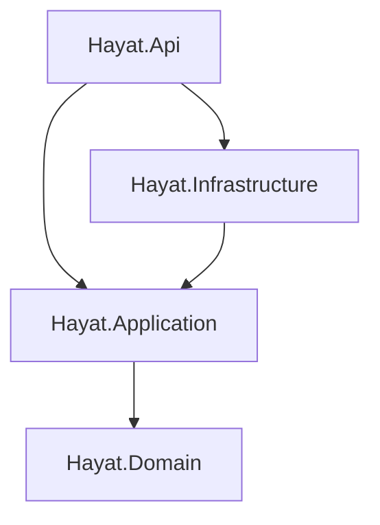

# Hayat — Yaşam Tarzı Takip Uygulaması (Faz 1: İskelet + Login)

Bu plan, analiz dokümanına uygun olarak projenin temel iskeletini ve JWT tabanlı kimlik doğrulama sistemini kurmayı kapsar.

## Teknoloji Stack'i

| Katman | Teknoloji | Versiyon |
|--------|-----------|----------|
| Backend | .NET Web API | **10.0 (LTS)** |
| ORM | Entity Framework Core | 10.x |
| Veritabanı | SQLite | — |
| Auth | JWT Bearer Token | — |
| Şifre Hash | BCrypt | — |
| Frontend | React + TypeScript | 19.x |
| Build Tool | Vite | 6.x |
| CSS | Tailwind CSS | **4.x** (CSS-first, config dosyası yok) |
| UI Kit | Shadcn UI | latest |
| Form | React Hook Form + Zod | — |
| Routing | React Router | 7.x |
| HTTP Client | Axios | — |

---

## User Review Required

> [!IMPORTANT]
> **Kullanıcı Tanımı**: İlk aşamada sabit (seed) bir kullanıcı oluşturulacaktır. Kullanıcı kayıt (register) fonksiyonu bu fazda **kapsam dışıdır**.

> [!IMPORTANT]
> **Veritabanı**: Hızlı başlangıç için **SQLite** kullanılacaktır. EF Core migration sayesinde üretim ortamında PostgreSQL/SQL Server'a geçiş kolaydır.

> [!IMPORTANT]
> **Tailwind CSS v4**: Config dosyası yerine **CSS-first** yaklaşım kullanılacaktır. Tema özelleştirmesi `@theme` direktifi ile `index.css` içinde yapılır.

> [!WARNING]
> **Token Saklama**: İlk fazda basitlik için JWT `localStorage`'da saklanacaktır. Üretim ortamında HttpOnly cookie yaklaşımına geçiş önerilir.

---

## Open Questions

> [!NOTE]
> **Varsayılan Kullanıcı**: Seed data olarak `admin / Admin123!` kullanıcı bilgisi oluşturulacaktır. Farklı bir tercih var mı?

> [!NOTE]
> **Port Konfigürasyonu**: Backend `https://localhost:5001`, Frontend `http://localhost:5173` olarak ayarlanacaktır.

> [!NOTE]
> **Dark Mode**: Bu fazda dark mode toggle eklensin mi, yoksa ileriki fazlara bırakılsın mı?

---

## Proje Klasör Yapısı

```
hayat/
├── backend/
│   ├── Hayat.sln
│   └── src/
│       ├── Hayat.Domain/                 # İş kuralları (sıfır bağımlılık)
│       │   ├── Entities/
│       │   │   └── User.cs
│       │   └── Hayat.Domain.csproj
│       │
│       ├── Hayat.Application/            # Use case'ler, DTO'lar, Interface'ler
│       │   ├── DTOs/
│       │   │   ├── LoginRequest.cs
│       │   │   └── LoginResponse.cs
│       │   ├── Interfaces/
│       │   │   ├── IAuthService.cs
│       │   │   └── ITokenService.cs
│       │   └── Hayat.Application.csproj
│       │
│       ├── Hayat.Infrastructure/         # EF Core, Servisler
│       │   ├── Data/
│       │   │   ├── AppDbContext.cs
│       │   │   └── SeedData.cs
│       │   ├── Services/
│       │   │   ├── AuthService.cs
│       │   │   └── TokenService.cs
│       │   └── Hayat.Infrastructure.csproj
│       │
│       └── Hayat.Api/                    # Composition Root
│           ├── Controllers/
│           │   └── AuthController.cs
│           ├── Properties/
│           │   └── launchSettings.json
│           ├── appsettings.json
│           ├── appsettings.Development.json
│           ├── Program.cs
│           └── Hayat.Api.csproj
│
└── frontend/
    ├── src/
    │   ├── components/
    │   │   ├── ui/                       # Shadcn UI (auto-generated)
    │   │   └── ProtectedRoute.tsx
    │   ├── contexts/
    │   │   └── AuthContext.tsx
    │   ├── pages/
    │   │   ├── LoginPage.tsx
    │   │   └── DashboardPage.tsx
    │   ├── services/
    │   │   └── api.ts
    │   ├── lib/
    │   │   └── utils.ts                  # Shadcn cn() utility
    │   ├── App.tsx
    │   ├── main.tsx
    │   └── index.css                     # Tailwind v4 @theme + @import
    ├── components.json                   # Shadcn config
    ├── tsconfig.json
    ├── vite.config.ts
    └── package.json
```

---

## Proposed Changes

### 1. Backend — .NET 10 Web API (Clean Architecture)

---

#### Solution & Proje Oluşturma Komutları

```bash
cd hayat/backend
dotnet new sln -n Hayat

dotnet new classlib -n Hayat.Domain -o src/Hayat.Domain
dotnet new classlib -n Hayat.Application -o src/Hayat.Application
dotnet new classlib -n Hayat.Infrastructure -o src/Hayat.Infrastructure
dotnet new webapi -n Hayat.Api -o src/Hayat.Api --use-controllers

dotnet sln add src/Hayat.Domain
dotnet sln add src/Hayat.Application
dotnet sln add src/Hayat.Infrastructure
dotnet sln add src/Hayat.Api

# Bağımlılık kuralları (Clean Architecture)
dotnet add src/Hayat.Application reference src/Hayat.Domain
dotnet add src/Hayat.Infrastructure reference src/Hayat.Application
dotnet add src/Hayat.Api reference src/Hayat.Application
dotnet add src/Hayat.Api reference src/Hayat.Infrastructure
```

**Bağımlılık Grafiği:**

- **Domain** → sıfır bağımlılık
- **Application** → yalnızca Domain'e bağımlı
- **Infrastructure** → Application'ın interface'lerini implement eder
- **Api** → Composition root, tüm katmanları bağlar

---

#### [NEW] Hayat.Domain — Entity'ler

##### [User.cs](file:///c:/Users/TEMP/Documents/antigravity/hayat/backend/src/Hayat.Domain/Entities/User.cs)

```csharp
public class User
{
    public int Id { get; set; }
    public string Username { get; set; } = string.Empty;
    public string PasswordHash { get; set; } = string.Empty;
    public string DisplayName { get; set; } = string.Empty;
    public DateTime CreatedAt { get; set; } = DateTime.UtcNow;
}
```

---

#### [NEW] Hayat.Application — DTO'lar & Interface'ler

##### [LoginRequest.cs](file:///c:/Users/TEMP/Documents/antigravity/hayat/backend/src/Hayat.Application/DTOs/LoginRequest.cs)
```csharp
public record LoginRequest(string Username, string Password);
```

##### [LoginResponse.cs](file:///c:/Users/TEMP/Documents/antigravity/hayat/backend/src/Hayat.Application/DTOs/LoginResponse.cs)
```csharp
public record LoginResponse(string Token, string DisplayName, DateTime ExpiresAt);
```

##### [IAuthService.cs](file:///c:/Users/TEMP/Documents/antigravity/hayat/backend/src/Hayat.Application/Interfaces/IAuthService.cs)
```csharp
public interface IAuthService
{
    Task<LoginResponse?> LoginAsync(LoginRequest request);
}
```

##### [ITokenService.cs](file:///c:/Users/TEMP/Documents/antigravity/hayat/backend/src/Hayat.Application/Interfaces/ITokenService.cs)
```csharp
public interface ITokenService
{
    string GenerateToken(User user);
}
```

---

#### [NEW] Hayat.Infrastructure — EF Core + Servisler

**NuGet Paketleri:**
```bash
cd src/Hayat.Infrastructure
dotnet add package Microsoft.EntityFrameworkCore.Sqlite
dotnet add package Microsoft.EntityFrameworkCore.Design
dotnet add package BCrypt.Net-Next
```

##### [AppDbContext.cs](file:///c:/Users/TEMP/Documents/antigravity/hayat/backend/src/Hayat.Infrastructure/Data/AppDbContext.cs)
- `DbSet<User> Users`
- `OnModelCreating` ile Username unique index
- SQLite connection string `appsettings.json`'dan gelir

##### [SeedData.cs](file:///c:/Users/TEMP/Documents/antigravity/hayat/backend/src/Hayat.Infrastructure/Data/SeedData.cs)
- `EnsureSeedData(IServiceProvider services)` statik metodu
- `admin / Admin123!` kullanıcısını BCrypt hash ile oluşturur
- Uygulama başlangıcında `Program.cs`'den çağrılır

##### [TokenService.cs](file:///c:/Users/TEMP/Documents/antigravity/hayat/backend/src/Hayat.Infrastructure/Services/TokenService.cs)
- `IConfiguration`'dan JWT ayarları okunur
- HMAC-SHA256 ile imzalı token
- Claims: `sub` (UserId), `unique_name` (Username), `name` (DisplayName)
- 7 gün geçerlilik süresi

##### [AuthService.cs](file:///c:/Users/TEMP/Documents/antigravity/hayat/backend/src/Hayat.Infrastructure/Services/AuthService.cs)
- Username ile kullanıcı aranır
- BCrypt.Verify ile şifre doğrulanır
- Başarılıysa TokenService üzerinden JWT döner
- Başarısızsa `null` döner

---

#### [NEW] Hayat.Api — Controllers & Program.cs

**NuGet Paketleri:**
```bash
cd src/Hayat.Api
dotnet add package Microsoft.AspNetCore.Authentication.JwtBearer
dotnet add package Microsoft.EntityFrameworkCore.Design
```

##### [AuthController.cs](file:///c:/Users/TEMP/Documents/antigravity/hayat/backend/src/Hayat.Api/Controllers/AuthController.cs)

| Endpoint | Method | Auth | Açıklama |
|----------|--------|------|----------|
| `/api/auth/login` | POST | ❌ | Giriş → JWT token |
| `/api/auth/me` | GET | ✅ | Token'dan kullanıcı bilgisi |

##### [Program.cs](file:///c:/Users/TEMP/Documents/antigravity/hayat/backend/src/Hayat.Api/Program.cs)

Middleware sırası:
1. `UseCors("AllowReactApp")` — `http://localhost:5173` izni
2. `UseAuthentication()`
3. `UseAuthorization()`
4. `MapControllers()`

DI Registrations:
- `AddDbContext<AppDbContext>` (SQLite)
- `AddScoped<IAuthService, AuthService>`
- `AddScoped<ITokenService, TokenService>`
- JWT Bearer authentication konfigürasyonu

##### [appsettings.Development.json](file:///c:/Users/TEMP/Documents/antigravity/hayat/backend/src/Hayat.Api/appsettings.Development.json)
```json
{
  "ConnectionStrings": {
    "DefaultConnection": "Data Source=hayat.db"
  },
  "Jwt": {
    "Issuer": "HayatApi",
    "Audience": "HayatApp",
    "SecretKey": "HayatAppSuperSecretKeyForDevelopment2026!!"
  }
}
```

---

### 2. Frontend — React + Vite + Tailwind CSS v4 + Shadcn UI

---

#### Proje Oluşturma Komutları

```bash
cd hayat/frontend
npm create vite@latest ./ -- --template react-ts
npm install
npm install tailwindcss @tailwindcss/vite
npm install -D @types/node
npm install axios react-router-dom react-hook-form @hookform/resolvers zod
npx shadcn@latest init
npx shadcn@latest add button card input label form
```

---

#### [NEW] [vite.config.ts](file:///c:/Users/TEMP/Documents/antigravity/hayat/frontend/vite.config.ts)

```typescript
import path from "path";
import tailwindcss from "@tailwindcss/vite";
import react from "@vitejs/plugin-react";
import { defineConfig } from "vite";

export default defineConfig({
  plugins: [react(), tailwindcss()],
  resolve: {
    alias: {
      "@": path.resolve(__dirname, "./src"),
    },
  },
});
```

---

#### [NEW] [index.css](file:///c:/Users/TEMP/Documents/antigravity/hayat/frontend/src/index.css)

Tailwind v4 CSS-first tema konfigürasyonu:

```css
@import "tailwindcss";

@theme {
  /* === Lifestyle App Renk Paleti === */
  --color-primary: oklch(0.55 0.12 160);        /* Sage Green */
  --color-primary-light: oklch(0.75 0.10 160);
  --color-primary-dark: oklch(0.40 0.12 160);

  --color-accent-gold: oklch(0.78 0.15 80);     /* Altın - Başarı/Streak */
  --color-accent-purple: oklch(0.55 0.15 290);   /* Mor - Deep Work */
  --color-accent-success: oklch(0.65 0.20 145);  /* Canlı Yeşil */

  --color-surface: oklch(0.97 0.005 100);        /* Kırık beyaz */
  --color-surface-dim: oklch(0.93 0.005 100);    /* Açık gri */

  /* === Tipografi === */
  --font-sans: 'Inter', system-ui, sans-serif;

  /* === Border Radius === */
  --radius-lg: 1rem;
  --radius-md: 0.75rem;
  --radius-sm: 0.5rem;
}
```

Google Fonts `Inter` main.tsx veya index.html'den yüklenecektir.

---

#### [NEW] [api.ts](file:///c:/Users/TEMP/Documents/antigravity/hayat/frontend/src/services/api.ts)

- Axios instance, base URL: `https://localhost:5001/api`
- **Request interceptor**: localStorage'dan token → `Authorization: Bearer` header
- **Response interceptor**: 401 hatası → localStorage temizle → `/login` redirect

---

#### [NEW] [AuthContext.tsx](file:///c:/Users/TEMP/Documents/antigravity/hayat/frontend/src/contexts/AuthContext.tsx)

- `user`, `token`, `isAuthenticated`, `isLoading` state'leri
- `login(username, password)` — API call → token kaydet → navigate
- `logout()` — token sil → `/login` yönlendir
- Sayfa yenilemesinde `localStorage`'dan oturum restore
- `useAuth()` custom hook export

---

#### [NEW] [ProtectedRoute.tsx](file:///c:/Users/TEMP/Documents/antigravity/hayat/frontend/src/components/ProtectedRoute.tsx)

- `isAuthenticated` false ise → `<Navigate to="/login" />`
- `isLoading` true ise → Loading spinner
- Authenticated ise → `<Outlet />`

---

#### [NEW] [LoginPage.tsx](file:///c:/Users/TEMP/Documents/antigravity/hayat/frontend/src/pages/LoginPage.tsx)

**Premium Tasarım Detayları:**

| Özellik | Detay |
|---------|-------|
| Layout | Tam ekran, ortalanmış, min-h-screen |
| Arka Plan | Sage green → deep teal **animated gradient** |
| Kart | **Glassmorphism** — backdrop-blur, yarı-saydam beyaz border |
| Logo | Uygulama adı "Hayat" + lifestyle ikonu üstte |
| Form | Shadcn `Form` + react-hook-form + zod validation |
| Input | Büyük, mobil dostu, rounded, soft focus ring |
| Button | Gradient primary buton, hover scale animasyonu |
| Error | Shake animasyonu + kırmızı alert card |
| Loading | Button içinde spinner + "Giriş yapılıyor..." text |
| Animasyon | Kart fade-in + slide-up keyframe animasyonu |
| Mobile | Tam genişlik kart, 16px padding, touch-friendly |

---

#### [NEW] [DashboardPage.tsx](file:///c:/Users/TEMP/Documents/antigravity/hayat/frontend/src/pages/DashboardPage.tsx)

- "Hoş geldin, {displayName}" karşılama
- Logout butonu
- Sonraki fazlar için placeholder yapı (Bottom Navigation Bar iskelet)

---

#### [NEW] [App.tsx](file:///c:/Users/TEMP/Documents/antigravity/hayat/frontend/src/App.tsx)

```
Routes:
  /login    → LoginPage       (public)
  /         → DashboardPage   (protected)
```

---

## Verification Plan

### Automated Tests

1. **Backend Build & Run:**
   ```bash
   cd backend
   dotnet build Hayat.sln
   dotnet run --project src/Hayat.Api
   ```
   - `POST /api/auth/login` — geçerli creds → 200 + JWT
   - `POST /api/auth/login` — geçersiz creds → 401
   - `GET /api/auth/me` — valid token → 200 + kullanıcı bilgisi
   - `GET /api/auth/me` — no token → 401

2. **Frontend Build & Run:**
   ```bash
   cd frontend
   npm run dev
   ```
   - Login sayfası render kontrolü
   - Form validation (boş alan, kısa şifre)
   - Başarılı giriş → Dashboard redirect
   - Başarısız giriş → Hata mesajı
   - Sayfa yenileme → Oturum korunması
   - Logout → Login'e redirect

3. **Browser Test:**
   - Chrome DevTools ile mobil responsive kontrol
   - Glassmorphism ve gradient render kontrolü
   - Animasyon performansı

### Manual Verification
- Login ekranının görsel kalitesi hakkında kullanıcıdan geri bildirim
- Mobil responsive davranış onayı
